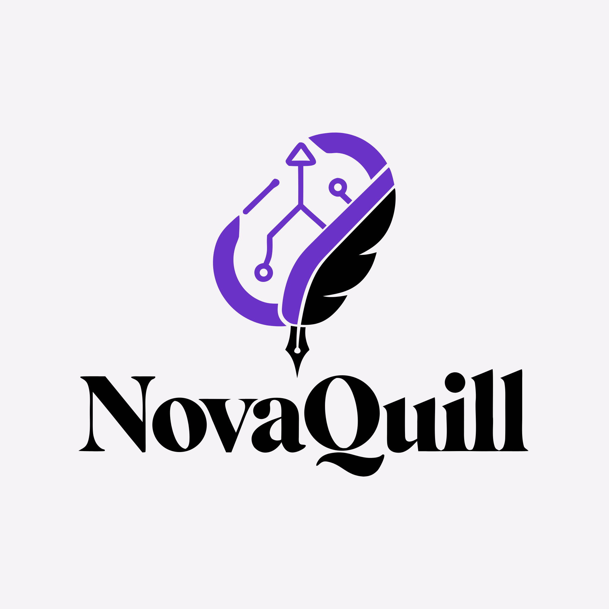
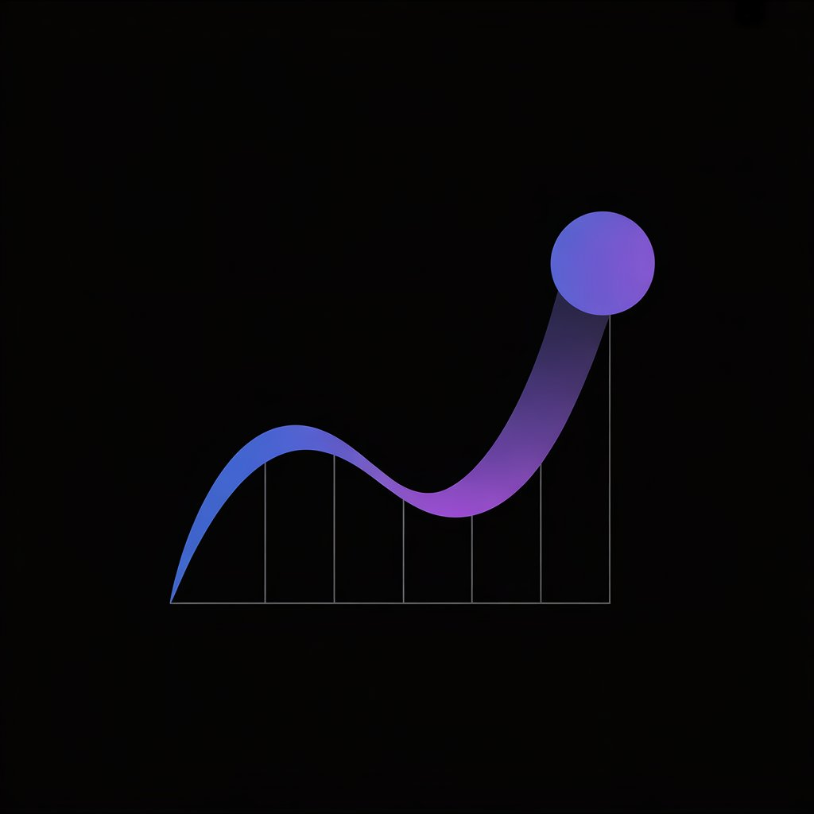

  

  
  
  
  

 

## About Me

I'm **Ayoub Zarkouni**, the developer behind **AyOuBzArO**. I turn ideas and business requirements into complete working software—from backend architecture, APIs, and databases to responsive interfaces and AI-powered features.

My work spans full-stack applications, SaaS products, business systems, API development, and practical AI integrations. I care about the whole product: how it works, how it feels to use, and how reliably it solves the problem it was built for.

## What I Build

<table>
  <tr>
    <td width="50%"><strong>Product applications</strong> Full-stack web apps · SaaS products · MVPs · developer tools</td>
    <td width="50%"><strong>Business software</strong> Admin dashboards · inventory systems · management platforms · analytics</td>
  </tr>
  <tr>
    <td width="50%"><strong>Backend systems</strong> Python applications · REST APIs · database-driven workflows</td>
    <td width="50%"><strong>Connected experiences</strong> AI-powered features · LLM workflows · third-party API integrations</td>
  </tr>
</table>

## Featured Projects

<table>
  <tr>
    <td width="88" align="center"></td>
    <td><h3>NovaQuill</h3><strong>AI Ebook Generation SaaS Platform</strong></td>
  </tr>
</table>

A full-stack SaaS that turns a niche into a structured, export-ready ebook through market analysis, plan-aware generation, quality review, and customizable publishing workflows. The product includes authentication, Stripe subscriptions, background generation, public sharing, and PDF, DOCX, and EPUB exports.

`Python` `FastAPI` `SQLAlchemy` `PostgreSQL` `JavaScript` `Stripe` `Groq` `Docker`

Market-ready and live, with ongoing product updates; its source repository is intentionally private.

---

<table>
  <tr>
    <td width="88" align="center"></td>
    <td><h3>CSAI Days 2026</h3><strong>International Tech Event Website</strong></td>
  </tr>
</table>

CSAI Days 2026 is an international technology event website presenting its Hackathon, Conference, and Exhibition through a responsive participant-facing experience. My role focused on frontend implementation across the event pages, multilingual switching in English, French, Spanish, and Arabic, Arabic RTL support, and public application workflows; deployment was handled by collaborator Issam.

`HTML5` `CSS3` `JavaScript` `Responsive Design` `i18n` `RTL`

---

<table>
  <tr>
    <td width="88" align="center"></td>
    <td><h3>DevScope</h3><strong>GitHub Portfolio Health Analyzer</strong></td>
  </tr>
</table>

A full-stack analyzer that uses public GitHub repository data, transparent heuristic scoring, analytics, and AI-assisted recommendations to surface portfolio strengths and areas for improvement. Its results are guidance—not an objective measure of developer quality or hiring suitability.

`Next.js` `React` `TypeScript` `FastAPI` `Python` `SQLite` `OpenRouter` `Docker`

---

<table>
  <tr>
    <td width="104" align="center"></td>
    <td><h3>IMS</h3><strong>Inventory &amp; Sales Dashboard</strong></td>
  </tr>
</table>

A database-backed business application for managing products, monitoring stock, recording sales, and understanding performance through dashboards and interactive charts. Its embedded assistant answers operational questions using current inventory data.

`Python` `FastAPI` `PostgreSQL` `SQLite` `JavaScript` `ApexCharts` `Groq` `Docker`

## Tech Stack

<table>
  <tr>
    <td><strong>Backend</strong></td>
    <td>Python · FastAPI · REST API design · SQLAlchemy</td>
  </tr>
  <tr>
    <td><strong>Frontend</strong></td>
    <td>HTML · CSS · JavaScript · TypeScript · React · Next.js · Tailwind CSS</td>
  </tr>
  <tr>
    <td><strong>Data</strong></td>
    <td>PostgreSQL · SQLite · Prisma</td>
  </tr>
  <tr>
    <td><strong>AI & integrations</strong></td>
    <td>LLM API integration · OpenRouter · Groq · GitHub REST API · Stripe</td>
  </tr>
  <tr>
    <td><strong>Engineering</strong></td>
    <td>Git · GitHub · Docker · Linux</td>
  </tr>
</table>

## What I Can Build for You

<table>
  <tr>
    <td width="50%"><strong>Launch a product</strong> Custom web applications, SaaS MVPs, and database-driven platforms.</td>
    <td width="50%"><strong>Run a business workflow</strong> Admin panels, analytics dashboards, inventory, and management systems.</td>
  </tr>
  <tr>
    <td width="50%"><strong>Build the backend</strong> REST APIs and Python services with FastAPI.</td>
    <td width="50%"><strong>Extend an existing app</strong> AI features, third-party integrations, debugging, and focused improvements.</td>
  </tr>
</table>

## Work With Me

> Have an idea, an existing application, or a business workflow you want to turn into reliable software? I'm available for selected freelance development projects.
>
> 

## Let's Connect

For project inquiries, the fastest way to reach me is through Fiverr. You can also explore my work on GitHub, connect on LinkedIn, or contact me directly by email.

---

Built by Ayoub Zarkouni · AyOuBzArO

